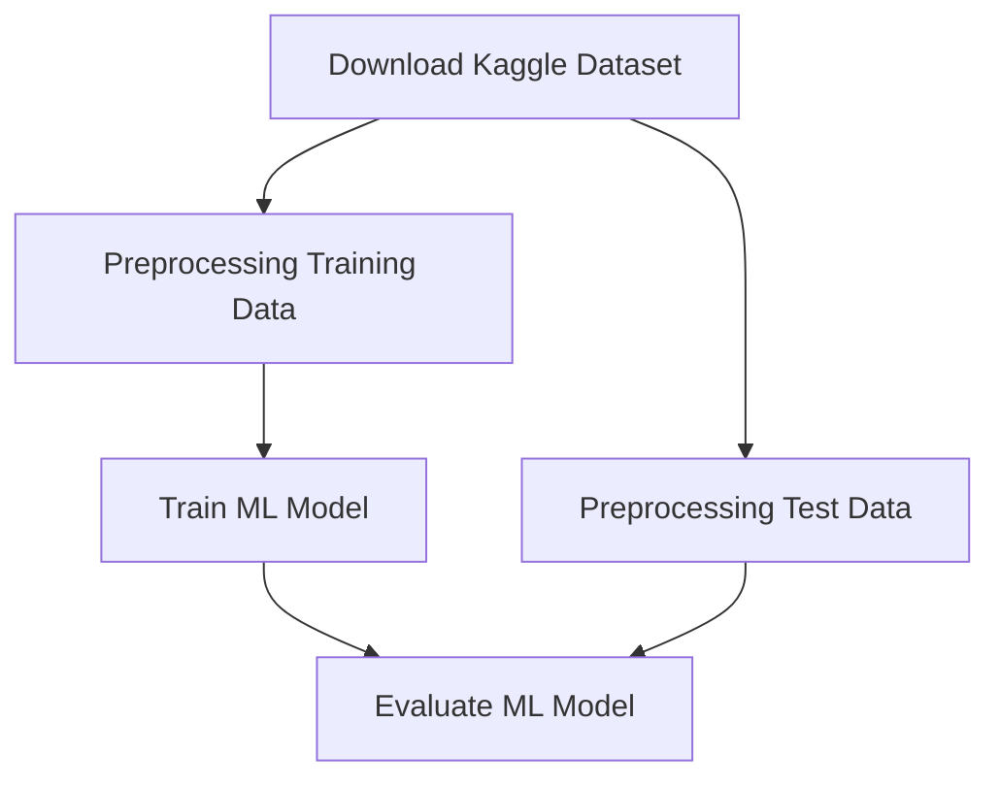

 
 

# CML Worflow for Training a CNN Model using DVC/ZnTrack

This repository contains the CML configuration as well as the Node configuration for the following Workflow.
It uses public GitHub Runners and a minio S3 storage.

Learn more about https://www.simtech.uni-stuttgart.de/
